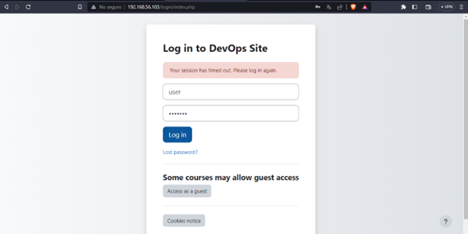
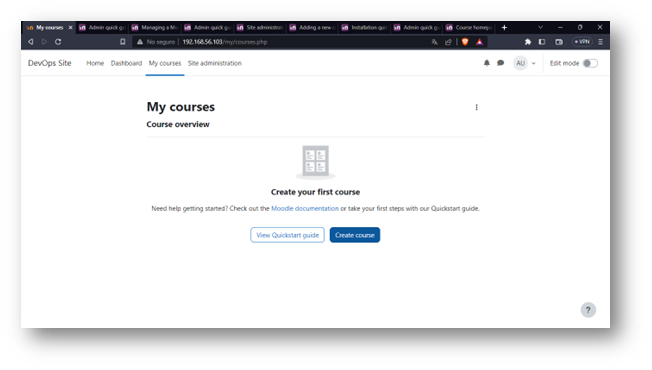
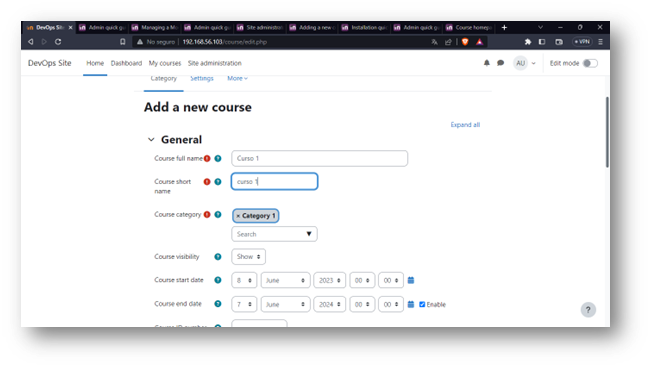
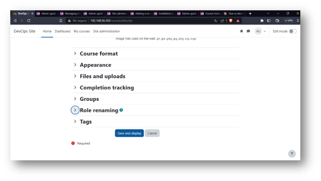
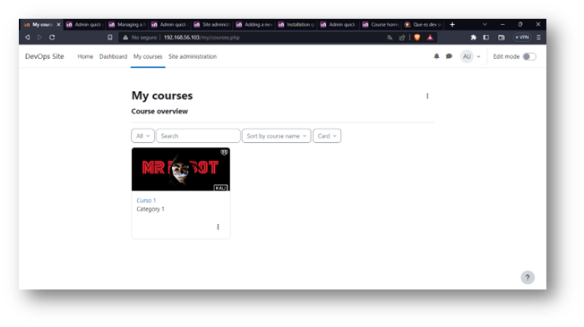
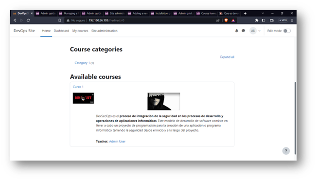

# DockerComposeMoodle.
Proyecto Final Despliegue de un Sistema con Docker.Equipo2

# Instalar Moodle y Crear un curso.

## Moodle y MariaDB.

- Instalación con docker-compose 

## Usuarios y Contraseñas que se deben cambiar en el archivo docker-compose.yml
   
   - MARIADB_USER=bn_moodle
   - MARIADB_PASSWORD=mypassword
    
    - MOODLE_DATABASE_USER=bn_moodle
    - MOODLE_DATABASE_PASSWORD=mypassword

### Correr localmente usando docker.

1. Clonar el repositorio al directorio local de instalación.

    git clone https://github.com/AndreAban619/DockerComposeMoodle.git

2. Para correr los contenedores.

        $cd DockerComposeMoodle

        $docker-compose up -d

3. Para detener los contenedores.

        $docker-compose stop

# Paso 1) Correr Moodle y Crear un curso.

- http://localhost/

- usuario = user
- contraseña = bitnami

# Paso 2)Login Moodle. 

- Press Log In button.

# Paso 3) Vamos a my courses 

- click en el botón create course.

# Paso 4) Rellenamos el formulario, en este caso se llama "Curso 1".

# Paso 5) Le damos click a save and display.

# Como podemos observar nuestro curso ya esta publicado.

# Desde la pestaña de home se observa asi.
- Como se puede observar le añadimos una descripción acompañada de una imagen y tambien una imagen representativa del curso.

